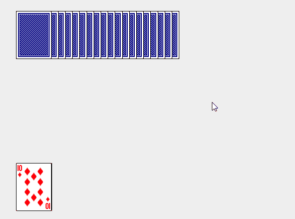

# 二、算法基础

## 排序问题（SORT）

**输入**：n个数的一个序列<a1, a2, a3, ..., an>

**输出**：输出一个排序的序列，满足a1 <= a2 <= ... <= a3

我们希望排序的数也叫 **关键词**，虽然概念上我们在一个排序的序列，但是输出是以 n 个元素的数组形式出现的。

### 插入排序

对于 **少量** 元素的排序，它是一个有效的算法。插入排序的工作方式，像许多人拿的排序一手扑克牌（由大到小的排列，或者由小到大的排列），开始我们随便取一张，放在手上，然后我们一张一张对比，插入到一个正确的位置。拿在手上的牌是我们已经排序的牌，牌堆里面的牌，是我们即将要排序的牌。

#### 举例：

Input: {5 2 4 6 1 3}。

首先拿起第一张牌, 手上有 {5}。

拿起第二张牌 2, 把 2 insert 到手上的牌 {5}, 得到 {2 5}。

拿起第三张牌 4, 把 4 insert 到手上的牌 {2 5}, 得到 {2 4 5}。

以此类推。

#### 图解：




#### 伪代码

对于插入排序，我们将其伪代码过程命名为 INSERTION-SORT, 其中的参数是一个数组 A[1...n]，包含长度为 n 的要用排序的一个序列。（在代码中，A中的元素长度用 A.length 来表示。）

该算法 **原址** 排序输入的数：算法在数组 A 中重排这些数，在任何时候，最多只有其中的常数个数存储在数组外面。

在排序过程结束后，输入数组 A 包含排序好的输出序列。

```伪代码
INSERTION-SORT(A)
    for j = 2 to A.length
        key = A[j]
        i = j - 1
        while i >=0 and A[i] > key
            A[i+1] = A[i]
            i = i - 1
        A[i+1] = key
```

#### Go 语言插入排序

```go

//InsertionSort 插入排序
func InsertionSort(arr []int) {
	len := len(arr)
	if len < 2 {
		return
	}
	for i := 1; i < len; i++ {
		key := arr[i]
		j := i - 1
		for j >= 0 && arr[j] > key {
			if arr[j] > arr[j+1] {
				arr[j], arr[j+1] = arr[j+1], arr[j]
				j = j - 1
			} else {
				break
			}
		}
		arr[j+1] = key
	}
	return
}
```


## 参考资料

* 1. [原址](https://baike.baidu.com/item/%E5%8E%9F%E5%9D%80)
